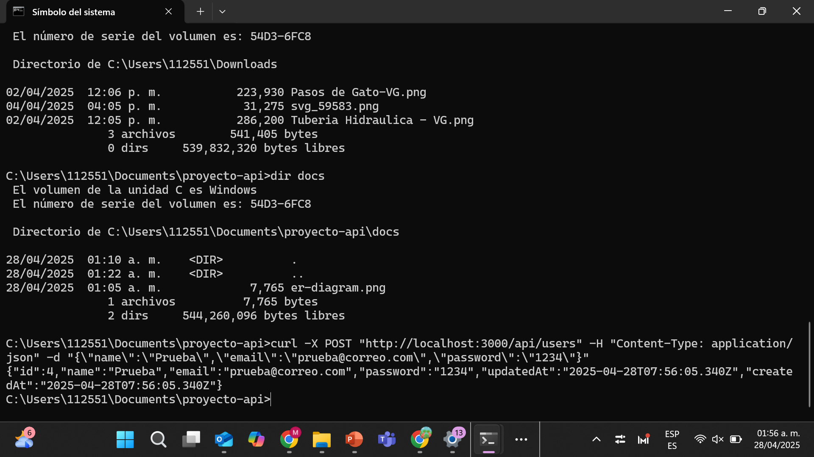

# Proyecto API con Node.js y Sequelize

Una pequeña REST API para gestionar usuarios con Node.js, Express y Sequelize (MySQL).

## 📦 Tecnologías

- Node.js v16+
- Express
- Sequelize CLI
- MySQL
- Curl para pruebas

## 🚀 Instalación

1. Clona el repositorio:
   ```bash
   git clone https://github.com/Alejandrocantu11/proyecto-api.git
   cd proyecto-api

## 🌐 Ejemplo de petición y respuesta

Puedes crear un usuario con:

```bash
curl -X POST "http://localhost:3000/api/users" \
  -H "Content-Type: application/json" \
  -d "{\"name\":\"Ana\",\"email\":\"ana@correo.com\",\"password\":\"1234\"}"```


   
